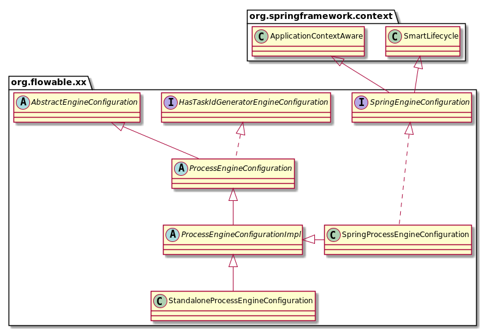

# flowable
## Configuration
### Creating a ProcessEngine 
-   ProcessEngine processEngine = ProcessEngines.getDefaultProcessEngine();
    说明：这将在类路径下查找 flowable.cfg.xml 文件，并根据文件中的配置构造一个引擎。
    
    示例配置文件展示如下：
    ```xml
    <beans xmlns="http://www.springframework.org/schema/beans"
           xmlns:xsi="http://www.w3.org/2001/XMLSchema-instance"
           xsi:schemaLocation="http://www.springframework.org/schema/beans http://www.springframework.org/schema/beans/spring-beans.xsd">
    
      <bean id="processEngineConfiguration" class="org.flowable.engine.impl.cfg.StandaloneProcessEngineConfiguration">
    
        <property name="jdbcUrl" value="jdbc:h2:mem:flowable;DB_CLOSE_DELAY=1000" />
        <property name="jdbcDriver" value="org.h2.Driver" />
        <property name="jdbcUsername" value="sa" />
        <property name="jdbcPassword" value="" />
    
        <property name="databaseSchemaUpdate" value="true" />
    
        <property name="asyncExecutorActivate" value="false" />
    
        <property name="mailServerHost" value="mail.my-corp.com" />
        <property name="mailServerPort" value="5025" />
      </bean>
    
    </beans>
    ```
    
    ProcessEngineConfiguration 对象被基于配置文件被构建的几种方式如下：
    ```java
    ProcessEngineConfiguration.
      createProcessEngineConfigurationFromResourceDefault();
      createProcessEngineConfigurationFromResource(String resource);
      createProcessEngineConfigurationFromResource(String resource, String beanName);
      createProcessEngineConfigurationFromInputStream(InputStream inputStream);
      createProcessEngineConfigurationFromInputStream(InputStream inputStream, String beanName);
    ```

    ProcessEngineConfiguration 不使用配置文件，被基于默认值创建如下：
    ```java
    ProcessEngineConfiguration.createStandaloneProcessEngineConfiguration();
    ProcessEngineConfiguration.createStandaloneInMemProcessEngineConfiguration();
    ```
-   flowable 配置类层级关系

       
    
-   ProcessEngine 关系类图    

    
    